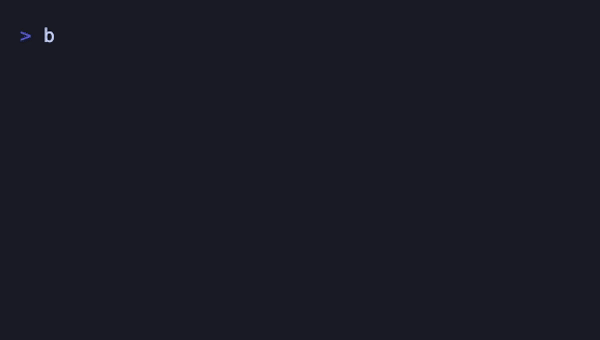
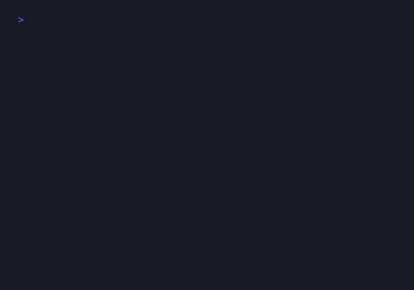
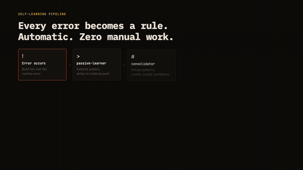
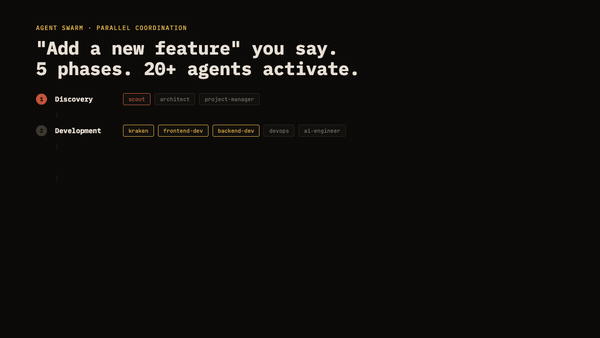
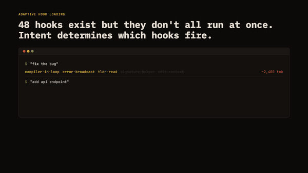

[← Back to English](../README.md)

<div align="center">

# vibecosystem

**Equipo de software IA construido sobre Claude Code.**

137 agents. 271 skills. 60 hooks. Cero trabajo manual.



</div>

---

## De un vistazo

| Metrica | Cantidad |
|---------|----------|
| Agents | **137** |
| Skills | **269** |
| Hooks | **53** |
| Rules | **22** |
| Trabajo manual | **0** |

---

## Que es esto?

vibecosystem convierte Claude Code en un equipo completo de software IA. No un simple asistente, sino un **equipo** de 137 agentes especializados que planifican, construyen, revisan, prueban y aprenden de cada error.

Sin modelo personalizado. Sin API personalizada. Solo el sistema de hooks + agents + rules de Claude Code, llevado al limite.

### La vision general



---

## Funcionalidades principales

### 1. Pipeline de autoaprendizaje

Cada error se convierte en una regla. Automaticamente.



```
Error happens → passive-learner captures pattern
→ consolidator groups & counts
→ confidence >= 5 → auto-inject into context
→ 10x repeat → permanent .md rule file
```

Sin intervencion manual. El sistema escribe sus propias reglas.

### 2. Agent Swarm

Di "agrega una nueva funcionalidad" y mas de 20 agentes se activan en 5 fases.



```
Phase 1 (Discovery):    scout + architect + project-manager
Phase 2 (Development):  backend-dev + frontend-dev + devops + specialists
Phase 3 (Review):       code-reviewer + security-reviewer + qa-engineer
Phase 4 (QA Loop):      verifier + tdd-guide (max 3 retry → escalate)
Phase 5 (Final):        self-learner + technical-writer
```

### 3. Carga adaptativa de hooks

Existen 60 hooks, pero no se ejecutan todos a la vez. La intencion determina cuales se activan.



```
"fix the bug"      → compiler-in-loop + error-broadcast     ~2,400 tok
"add api endpoint"  → edit-context + signature-helper + arch  ~3,100 tok
"explain this code" → (nothing)                               ~800 tok
```

### 4. Dev-QA Loop

Cada tarea pasa por una puerta de calidad:

```
Developer implements → code-reviewer + verifier check
→ PASS → next task
→ FAIL → feedback to developer, retry (max 3)
→ 3x FAIL → escalate (reassign / decompose / defer)
```

### 5. Canavar Cross-Training

Cuando un agente comete un error, todo el equipo aprende de el.

```
Agent error → error-ledger.jsonl → skill-matrix.json
→ All agents get the lesson at session start
→ Team-wide error prevention
```

### 6. Assignment Matrix

Tabla de enrutamiento de 74 filas: cada tipo de tarea se asigna al agente correcto.

```
GraphQL API      → graphql-expert  (backup: backend-dev)
Kubernetes       → kubernetes-expert (backup: devops)
DDD modeling     → ddd-expert      (backup: architect)
Bug reproduction → replay          (backup: sleuth)
... 70 more rows
```

---

## Arquitectura

```
┌─────────────────────────────────────────────────────────┐
│                    Claude Code                          │
│                                                         │
│  ┌──────────┐  ┌──────────┐  ┌──────────┐              │
│  │  Hooks   │  │  Agents  │  │  Skills  │              │
│  │  (53)    │→ │  (137)   │← │  (269)   │              │
│  └────┬─────┘  └────┬─────┘  └──────────┘              │
│       │              │                                   │
│       ▼              ▼                                   │
│  ┌──────────┐  ┌──────────┐                              │
│  │  Rules   │  │  Memory  │                              │
│  │  (22)    │  │ (PgSQL)  │                              │
│  └──────────┘  └──────────┘                              │
│                                                         │
│  ┌──────────────────────────────────────┐                │
│  │  Self-Learning Pipeline             │                │
│  │  instincts → consolidate → rules    │                │
│  └──────────────────────────────────────┘                │
│                                                         │
│  ┌──────────────────────────────────────┐                │
│  │  Canavar Cross-Training             │                │
│  │  error-ledger → skill-matrix → team │                │
│  └──────────────────────────────────────┘                │
└─────────────────────────────────────────────────────────┘
```

---

## Categorias de agentes

| Categoria | Cantidad | Ejemplos |
|-----------|----------|----------|
| Core Dev | 14 | frontend-dev, backend-dev, kraken, spark, devops, website-cloner |
| Review & QA | 8 | code-reviewer, security-reviewer, verifier, qa-engineer |
| Domain Experts | 35 | graphql-expert, kubernetes-expert, ddd-expert, redis-expert |
| Architecture | 8 | architect, planner, clean-arch-expert, cqrs-expert |
| Testing | 6 | tdd-guide, e2e-runner, arbiter, mocksmith |
| DevOps & Cloud | 12 | aws-expert, gcp-expert, azure-expert, terraform-expert |
| Analysis | 11 | scout, sleuth, data-analyst, profiler, strategist |
| Orchestration | 16 | nexus, sentinel, commander, neuron, vault, nitro |
| Documentation | 6 | technical-writer, doc-updater, copywriter, api-doc-generator, document-generator |
| Learning | 7 | self-learner, canavar, reputation-engine, session-replay-analyzer |

---

## Stack tecnologico

| Componente | Tecnologia |
|------------|-----------|
| Runtime | Claude Code (Claude Max) |
| Models | Opus 4.6 / Sonnet 4.6 |
| Hook engine | TypeScript → esbuild → .mjs |
| Memory DB | PostgreSQL + pgvector (Docker) |
| Agent format | Markdown + YAML frontmatter |
| Skill format | prompt.md / SKILL.md |
| Cross-training | JSONL ledger + JSON skill matrix |

---

## Filosofia

```
hooks are sensors. observe, filter, signal.
agents are muscles. build, produce, fix.
the bridge between them: context injection.
no direct RPC. no message passing. by design.
implicit coordination through context.
```

Los hooks son sensores. Observan, filtran, senalizan.
Los agentes son musculos. Construyen, producen, reparan.
El puente entre ellos: inyeccion de contexto.
Sin RPC directo. Sin paso de mensajes. Por diseno.
Coordinacion implicita a traves del contexto.

---

## License

MIT

---

<div align="center">

**Built by [@vibeeval](https://x.com/vibeeval)**

Sin modelo personalizado. Sin API personalizada. Solo buena ingenieria.

</div>
